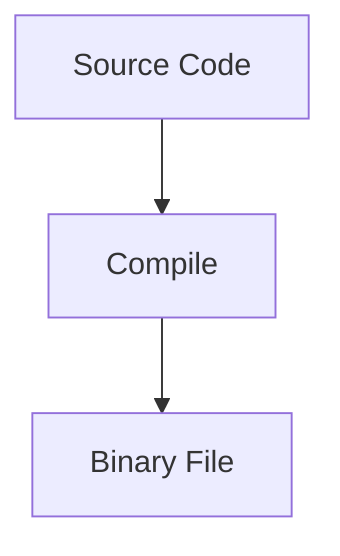
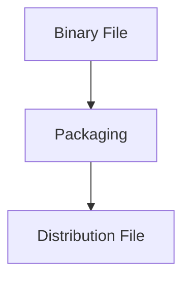
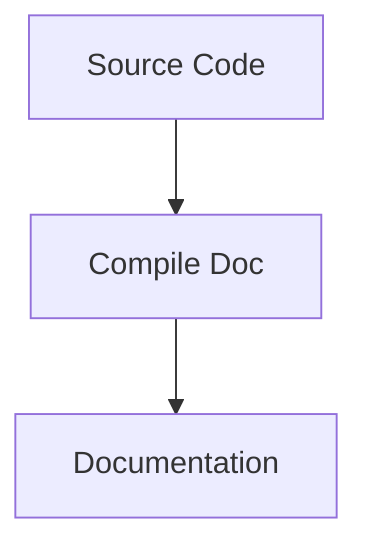
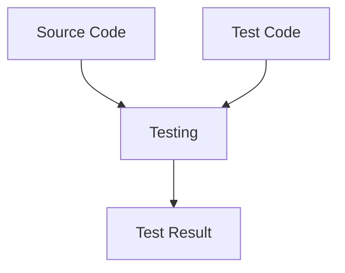
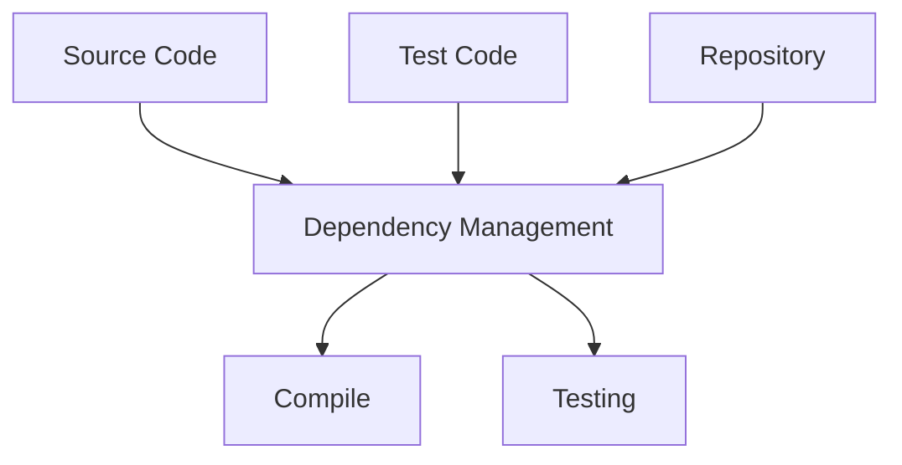

# Pengenalan Build Automation
- Build Automation adalah proses meng-otomatisasi tahapan pembuatan software dan hal-hal yang berhubungan dengannya, seperti: kompilasi source code menjadi binary code, mem-package binary code menjadi distribution file, membuat dokumentasi, menjalankan automated test sampai manajemen dependency.

## Kompilasi Source Code


## Mem-package Binary File


## Membuat Dokumentasi


## Menjalankan Automated Test


## Management Dependency


## Contoh Build Automation Tool
- Apache Maven
- Apache Ivy
- Gradle

## Pengenalan Apache Maven
- Apache Maven adalah salah satu build automation yang free dan open source.
- Apache menggunakan XML untuk mendefinisikan build script-nya.
- Apache Maven saat ini sangat populer di kalangan Developer Java.
- Apache Maven menggunakan JVM sebagai fondasi dasar.
- [Dokumentasi Apache Maven](https://maven.apache.org)

### Teknologi yang Didukung
Apache Maven mendukung build automation untuk banyak teknologi, seperti:
- Java
- Kotlin
- Groovy
- Scala
- dan lain-lain

# Menginstall Apache Maven

## Download Maven
- [Link Download Apache Maven](https://maven.apache.org/download.cgi)

## Setting Path
```text
# Add to .bashrc or .zshrc

export MAVEN_HOME="usr/local/Cellar/maven/3.6.3_1"
export PATH="$MAVEN_HOME/bin:$PATH"
```

## Mengecek Apache Maven
```shell
mvn --version
```

# Membuat Project

## Archetype
- Maven mendukung pembuatan berbagai macam project dengan mudah.
- Pembuatan project di maven menggunakan archetype, archetype adalah template project.
- Kita bisa menggunakan yang sudah disediakan oleh maven, atau bahkan bisa membuat template archetype sendiri.
- [Dokumentasi Archetype](https://maven.apache.org/guides/introduction/introduction-to-archetypes.html).

## Membuat Java Project
```shell
mvn archetype:generate
```
```shell
maven-archetype-quickstart
```

# Maven Lifecycle

## Lifecycle
- Maven bekerja dalam konsep lifecycle.
- Untuk menjalankan lifecycle, kita bisa menggunakan perintah ```mvn namalifecycle```
- Lifecycle akan menjalankan banyak plugin, entah bawaan maven, atau bisa kita tambahkan plugin lain jika mau.
- [Dokumentasi Lifecycle Maven](https://maven.apache.org/guides/introduction/introduction-to-the-lifecycle.html).

## Contoh Lifecycle
- ```mvn clean```, menghapus folder target (tempat menyimpan hasil kompilasi).
- ```mvn compile```, untuk melakukan kompilasi source code project.
- ```mvn test-compile```, untuk melakukan kompilasi test source code project.
- ```mvn test```, untuk menjalankan unit test.
- ```mvn package```, untuk membuat distribution file aplikasi.
- ```mvn install```, untuk menginstall project ke local repository, sehingga bisa digunakan di project lain di local.
- ```mvn deploy```, deploy project ke remote repository di server.

# Build Project
- Saat kita membuat project biasanya akan ada 2 jenis kode yang kita buat, kode program-nya, dan kode unit testing-nya.
- Maven mendukung hal tersebut.

# Dependency
- Proyek aplikasi jarang sekali berdiri sendiri, biasanya membutuhkan dukungan dari pihak lain, seperti tool atau library.
- Tanpa build tool seperti Apache Maven, untuk menambahkan library dari luar, kita harus melakukannya secara manual.
- Apache Maven mendukung dependency management, dimana kita tidak perlu me-manage secara manual proses penambahan dependency (tool atau library) ke dalam proyek aplikasi kita.

## Dependency Scope
Saat kita menambahkan dependency ke project Maven, kita harus menentukan scope dependency tersebut, ada banyak scope yang ada di Maven, namun sebenarnya hanya beberapa saja yang sering kita gunakan, seperti:
- compile, ini adalah scope default. Compile artinya dependency tersebut akan digunakan untuk build project, test project dan menjalankan project.
- test, ini adalah scope untuk test project, hanya akan di include di bagian test project.
- Kode: Menambahkan Dependency
```xml
<project>
    <dependencies>
        <dependency>
            <groupId>junit</groupId>
            <artifactId>junit</artifactId>
            <version>4.11</version>
            <scope>test</scope>
        </dependency>
    </dependencies>
</project>
```

## Mencari Dependency
- [Search Maven](https://search.maven.org/).
- [Maven Repository](https://mvnrepository.com/).

## Repsitory

- Kode: Menambah Repository
```xml
<project>
    <repositories>
        <repository>
            <id>bintray-bliblidotcom-maven</id>
            <name>bintray</name>
            <url>https://dl.bintray.com/bliblidotcom/maven</url>
        </repository>
    </repositories>
</project>
```

# Maven Properties
- Maven mendukung properties untuk menyimpan data konfigurasi.
- Fitur ini sangat memudahkan kita kedepannya, dibandingkan melakukan hardcode di konfigurasi maven.
- Kode: Properties
```xml
<project>
    <properties>
        <project.build.sourceEncoding>UTF-8</project.build.sourceEncoding>
        <maven.compiler.source>14</maven.compiler.source>
        <maven.compiler.target>14</maven.compiler.target>
        <junit.version>4.6.2</junit.version>
    </properties>
</project>
```
- Kode: Menggunakan Properties
```xml
<project>
    <dependencies>
        <dependency>
            <groupId>org.junit.jupiter</groupId>
            <arfifactId>junit-jupiter</arfifactId>
            <version>${junit.version}</version>
            <scope>test</scope>
        </dependency>
    </dependencies>
</project>
```

# Membuat Distribution File
- Secara default, maven mendukung pembuatan distribution file menggunakan lifecycle package.
- Hanya saja, hasil distribution file-nya berupa jar yang berisikan binary code dari project kita.
- Dependency lainnya tidak dimasukkan, sehingga tidak bisa langsung dijalankan.

## Menggunakan Assembly Plugin
- Salah satu plugin yang bisa kita gunakan untuk membuat distribution file beserta dependency yang kita butuhkan adalah Assembly Plugin.
- [Assembly Plugin](https://maven.apache.org/plugins/maven-assembly-plugin/usage.html).
- Tidak hanya assembly plugin, sebenarnya masih banyak plugin lain yang bisa kita gunakan untuk membuat distribution file di Maven.
- Untuk membuat distribution file, kita bisa menggunakan perintah ```mvn package assembly:single```.